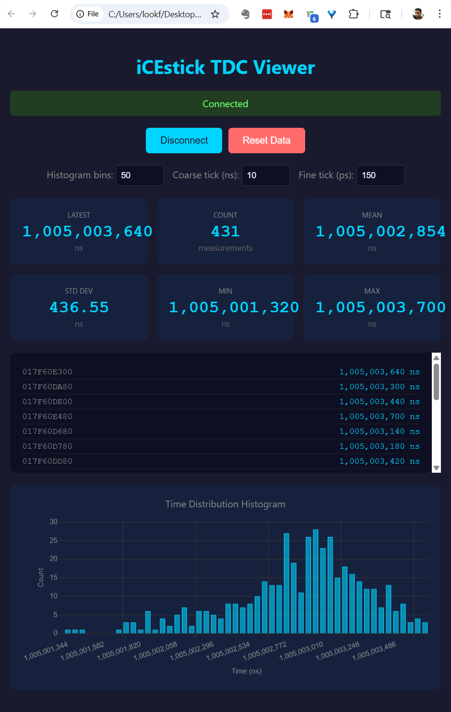
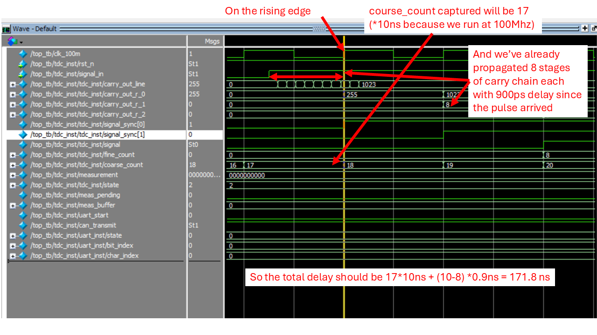

# iCEstick Time-to-Digital Converter (TDC)

This file provides guidance to Claude Code (claude.ai/code) when working with code in this repository.

## Project Overview

Time-to-Digital Converter (TDC) for the iCEstick (ICE40HX1K-STICK-EVN). Measures time intervals between START and STOP pulses with ~1ns resolution over a 2.68 second range, using a 100 MHz coarse counter and 64-tap carry chain delay line.



This is a toy-application to explore how good Claude Code is with Verilog. The results aren't accurate at least because:

1. The carry chain value `fine_count` should be carefully added to `coarse_count`.



2. The carry chain value `fine_count` should additionally be captured on the first pulse, and a subtraction between the second and the first `fine_count` should happen. The result (signed number) should be sent to the UI.
3. Everything should be tested and carefully calibrated. The carry-chain latency has to be characterized for each unit (including routing delays) as well as get a sense of how those delays change with e.g. temperature.

## Build Commands

```bash
make all      # Full build: synthesis, place & route, bitstream
make prog     # Program the iCEstick via USB
make clean    # Remove build artifacts
make synth    # Synthesis only (yosys)
make pnr      # Place & route only (nextpnr-ice40)
make timing   # Timing analysis (icetime)
```

Requires: yosys, nextpnr-ice40, icestorm (icepack, iceprog, icetime)

## Architecture

```
12MHz → [PLL] → 100MHz → [TDC_CORE] → [UART_TX] → PC
                              ↓
                        [DELAY_LINE]
```

- **top.v**: Top-level integration, input synchronization, auto-arm logic
- **pll.v**: SB_PLL40_CORE generating 100 MHz from 12 MHz
- **tdc_core.v**: State machine (IDLE→ARMED→MEASURING→DONE), 28-bit coarse counter (2.68s range)
- **delay_line.v**: 64-stage SB_CARRY chain for sub-cycle interpolation (~150ps/tap, ~9.6ns total)
- **uart_tx.v**: 115200 baud transmitter, outputs 40-bit measurement as hex ASCII

## Pin Assignments

| Signal | Pin | Function |
|--------|-----|----------|
| clk_12m | 21 | 12 MHz oscillator |
| start_in | 78 | START trigger (PMOD J2 pin 1) |
| stop_in | 79 | STOP trigger (PMOD J2 pin 2) |
| uart_tx | 8 | UART to FTDI |
| led[0-3] | 99,98,97,96 | Status LEDs |

## Output Format

UART sends 10 hex digits + newline for each measurement (40-bit value):
- Bits [39:34]: Unused (zero)
- Bits [33:6]: Coarse count (10ns per tick @ 100 MHz, 28 bits = 2.68s max)
- Bits [5:0]: Fine count (~150ps per tick from 64-tap delay line)

Example: `000000D4A0\n` = 0xD4A0 = 54432 ticks ≈ 272 µs

## Viewer

`viewer.html` - Single-page web app (Chrome/Edge) for visualizing measurements:
- Connects via Web Serial API at 115200 baud
- Rolling display of recent measurements
- Live statistics (count, mean, std dev, min, max)
- Histogram of time distribution (Chart.js)


## How to build on Windows

Install OSS CAD Suite, and make.

Source `oss-cad-suite\environment.bat` to setup the environment.

Go to the directory and `make all`.

Use the "Diamond Programmer" as described in "Programming Demo Designs with
Lattice Programmer" section of the iCEstick Evaluation Kit User's Guide.
The `.bin` file will be inside the `build` directory.
